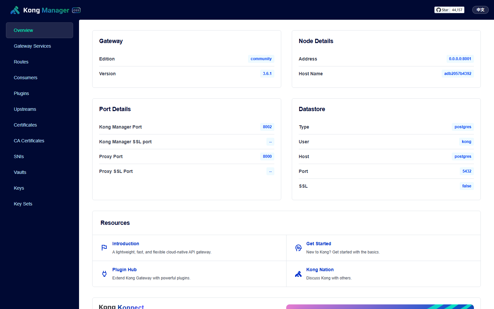
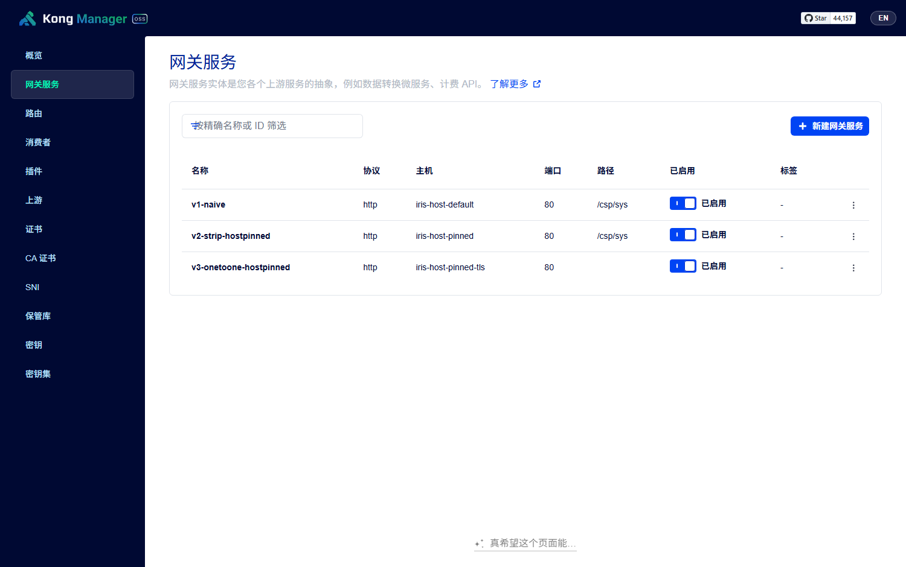
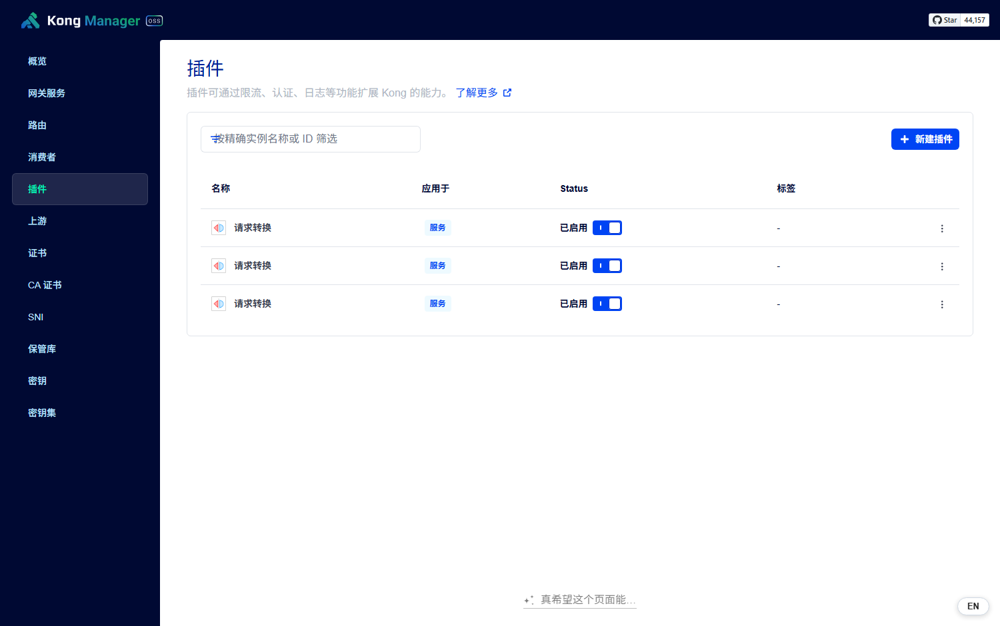

# Kong Manager 中文国际化（运行时注入）

为本地 Docker 中运行的 **Kong Manager OSS 3.6.x** 增加中英文切换能力。方案在浏览器端注入一段脚本、对界面文案做运行时替换，**无需重编译前端、不修改 Kong 原版镜像中的任何文件**。

## 特性

- 侧边栏、列表页、详情页、表单、错误页、404 页全部中文化
- 顶部导航栏右上角一键切换中英文，默认中文
- 支持 URL 参数 `?km-lang=zh|en` 直传语言
- 零改动 Kong 原文件，注入脚本独立、可整体移除
- 内置约 510 条词典 + 30 条动态文案正则，覆盖主要界面

## 效果预览

> 以下截图均来自本地 Docker 中真实运行的 Kong Manager OSS 3.6.1（端口 8002），非模拟。

| 中文首页 | 英文对照 |
| --- | --- |
|  |  |

| 服务列表（中文） | 插件页（中文） |
| --- | --- |
|  |  |

## 环境要求

| 项目 | 说明 |
|---|---|
| Kong Manager | OSS 3.6.x（已在 3.6.1 验证） |
| 部署 | Docker Desktop |
| 部署脚本 | Windows PowerShell |
| 适用版本 | 仅 Kong OSS；Enterprise / Konnect 前端不同，不适用 |

## 目录结构

| 文件 | 说明 |
|---|---|
| `i18n-zh.js` | 核心引擎：词典 + 动态正则 + 双路径翻译 + 切换按钮 |
| `apply-i18n.ps1` | 一键部署脚本（备份 / 注入 / 校验，幂等可重跑） |
| `index.patched.html` | 注入脚本引用后的 `index.html`（由脚本从容器内现文件生成） |
| `index.orig.html` | 首次运行自动备份的原始 `index.html` |
| `kconfig.js` | 历史探索产物，真机无效，请勿使用（原因见工作原理） |
| `screenshots/` | 真实 Kong 与离线沙箱的中英对照截图 |
| `extract-strings.ps1` | 从前端包提取官方 message 词典的辅助脚本 |

## 快速开始

### 一键部署

在仓库根目录执行：

```powershell
powershell -ExecutionPolicy Bypass -File .\apply-i18n.ps1
```

脚本依次完成：确认容器运行中 → 首次运行备份 `index.html` → 从容器内当前 `index.html` 生成注入版 → `docker cp` 到容器 → HTTP 校验。

完成后打开 `http://127.0.0.1:8002/`，右上角导航栏即为语言切换按钮。若浏览器缓存旧版，按 `Ctrl+F5` 强刷（注入脚本带 `?v=4` 版本号做缓存击穿）。

### 持久化（容器重建后保持）

`docker cp` 只写入容器可写层，容器重建即丢失。生产用法是把两个文件以只读方式挂载进容器（已写入 `compose-kong.yml`）：

```yaml
volumes:
  - ./kong.yml:/etc/kong/kong.yml:ro
  - ./kong-manager-i18n/index.patched.html:/usr/local/kong/gui/index.html:ro
  - ./kong-manager-i18n/i18n-zh.js:/usr/local/kong/gui/i18n-zh.js:ro
```

生效步骤：

```powershell
# 1) 生成/刷新 index.patched.html（容器运行时执行）
powershell -ExecutionPolicy Bypass -File .\apply-i18n.ps1
# 2) 让挂载生效
docker compose -f compose-kong.yml up -d
```

> Kong 镜像升级后必须重跑第 1 步：镜像升级会更换前端资源包名（如 `index-a9568421.js` → 新 hash），`index.html` 内的引用随之变化。`apply-i18n.ps1` 不硬编码任何 hash，读取容器内**当前**的 `index.html` 再注入，重跑即自愈。

### 卸载

```powershell
# 方式一：还原备份
docker cp .\index.orig.html kong-wsdl-test:/usr/local/kong/gui/index.html
docker exec kong-wsdl-test rm -f /usr/local/kong/gui/i18n-zh.js
# 方式二：直接重建容器（推荐）
docker compose -f compose-kong.yml up -d --force-recreate kong
```

## 使用

### 语言切换

- 按钮位于**顶部导航栏右上角**，与 Star 徽章同行：中文界面显示 `EN`，英文界面显示 `中文`
- 点击后写入 `localStorage['km-lang']` 并刷新
- 默认语言为**中文**（首次访问即中文）

### URL 直传

| URL | 效果 |
|---|---|
| `http://127.0.0.1:8002/` | 跟随 localStorage，默认中文 |
| `http://127.0.0.1:8002/?km-lang=zh` | 强制中文，并写回偏好 |
| `http://127.0.0.1:8002/?km-lang=en` | 强制英文，并写回偏好 |

### 调试接口

浏览器控制台可用：

```js
__kmI18n.lang                    // 当前语言
__kmI18n.size                    // 词典条数
__kmI18n.translate('Upstreams') // '上游'（返回 null 表示未命中）
__kmI18n.scan()                  // 手动全量重扫
```

## 工作原理

### 为什么必须客户端注入

Kong Manager 虽然内置一套基于 `@formatjs/intl` 的 i18n 层，但 `locale` 与 `messages` 均为编译期写死的模块内常量、intl 实例活在模块闭包中，运行时没有任何可切换 locale 的全局钩子。因此其消息表（结构化键值对）被提取为本项目的词典源，而切换语言只能通过在渲染出口做文案替换来实现。

### 注入点：为什么是 index.html 而非 kconfig.js

`index.html` 引用两个脚本：

```html
<script type="text/javascript" src="/__km_base__/kconfig.js"></script>
<script type="module" crossorigin src="/__km_base__/assets/index-a9568421.js"></script>
```

其中 `/kconfig.js` 是 nginx 的**精确匹配** location，由 Lua 动态生成（`Kong.admin_gui_kconfig_content()`），往 `gui` 目录放同名静态文件会被 Lua 拦截、永不读取，且 `generate_kconfig()` 只枚举 6 个 kong.conf 变量、无任何自定义注入口。因此唯一可行的注入点是在 `index.html` 主包之前插入一行：

```html
<script type="text/javascript" src="/__km_base__/i18n-zh.js?v=4"></script>
```

经典脚本同步执行，module 脚本 deferred，故 i18n 引擎一定先于应用主包就绪。路径前缀 `/__km_base__/` 由 Kong 按 `ADMIN_GUI_PATH` 动态改写（`sub_filter '/__km_base__/' '/'`），无论 `admin_gui_path` 配成 `/` 还是 `/kong` 都无需改动挂载。

### 翻译机制

纯文本替换的难点在于时序——DOM 更新随时发生，替换晚了会闪英文。方案采用双路径：

- **写入拦截**：替换 `nodeValue` / `data` / `textContent` / `innerText` / `setAttribute` / `document.title` 的 setter，在文本落地瞬间即翻译。
- **MutationObserver 兜底**：观察 `documentElement` 的子树变更，递归翻译新增文本节点与白名单属性（`placeholder` / `title` / `aria-label` / `alt`）。Vue 3 首屏文本经 `createTextNode()` 入树、不经过任何 setter，故 Observer 是必需项而非优化项。

防死循环依赖两条性质：词典单向（英文→中文，中文再查返回 null 不再写回）、所有写入走原始 setter。仅翻译文本节点与白名单属性，绝不碰表单 `value`、用户输入、服务名、ID、路径等数据。

### 动态文案

运行期拼接的文案（带变量、插值）无法用静态词典覆盖，由 30 条正则模式处理，例如详情页标题 `Gateway Service: xxx`、浏览器标签 `Overview | Kong Manager`。另含一小段 CJK 排版修正 CSS（`word-break: keep-all`），避免 `格式：` 类短标签被逐字换行。

## 扩展词典

在 `i18n-zh.js` 的 `DICT` 对象追加一行：

```js
'Load Balancing': '负载均衡',
```

扩展前先用控制台确认实际文案，避免凭猜测填词：

```js
__kmI18n.translate('Load Balancing')   // 返回 null 说明界面文本并非此拼写
```

若界面显示英文但 `translate` 返回 null，常见两类原因：

1. 文本被拆成多个节点（如 404 正文 `"We cannot find the page " + "you were looking for."`），词典需按片段写而非整句。
2. 文案来自 Admin API 的插件 schema 描述，不在前端包内。

## 已知限制

1. **插件 schema 描述仍是英文**：由 Admin API 运行时返回，不在前端产物中，静态词典覆盖不到。
2. **词典为穷举式**：约 510 条覆盖全部导航、列表、详情、表单、错误态，冷门插件配置项可能遗漏，遇到补一行即可。
3. **挂载方式下镜像升级需重跑 `apply-i18n.ps1`**（原因见快速开始·持久化）。
4. **仅验证 Kong OSS**：Enterprise / Konnect 的 Manager 为另一套前端，不适用。
5. **语言偏好按 origin 隔离**：换端口或域名访问不共享。

## License

MIT
